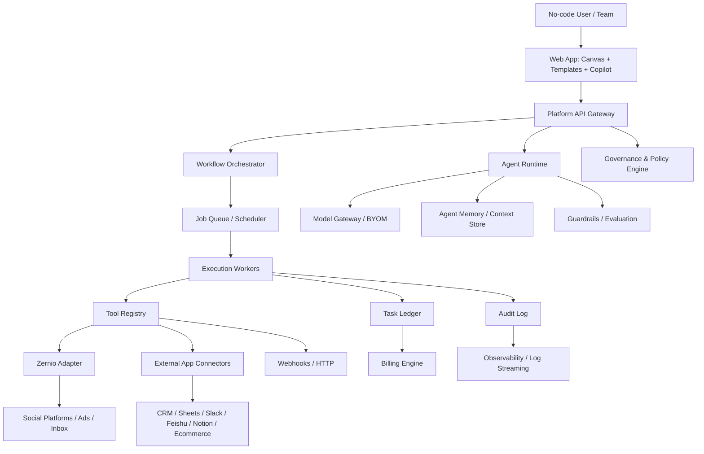
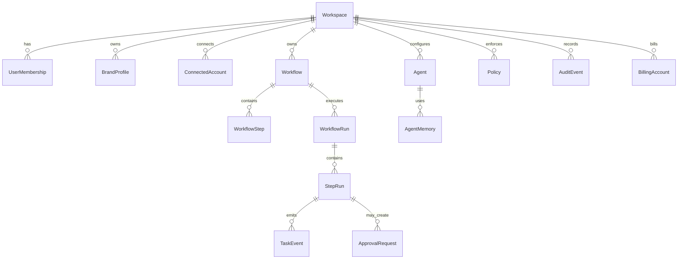

# AI Agent Automation Platform Product Architecture — Draft v0.1

> Date: 2026-07-01  
> Working name: **Piggybot**（临时名：Zernio social automation base + Zapier-style task automation + AI agent governance）  
> Method: Superpowers-style spec-first workflow：竞品观察 → 产品假设 → 架构设计 → MVP 路线；进入工程实现前仍需确认 MVP 优先级与技术栈。

---

## 1. Executive Summary

Zerflow AI 是一个面向 **no-code users、增长团队、内容团队、代理商与开发者** 的 AI Agent Automation Platform。

它以 Zernio 的统一社交媒体 / 广告 / 评论私信 API 能力为基础，向外扩展为可视化自动化平台：用户不需要写 API 调用，也可以通过模板、自然语言 Copilot、可视化 Flow Builder，把“内容生成 → 审批 → 多平台发布 → 评论/DM 处理 → CRM/表格/IM 同步 → 广告优化 → 报告复盘”串成自动化工作流。

商业模式借鉴 Zapier 的 **task-based usage**：平台按自动化实际执行的成功动作计费，同时保留 Zernio 式“连接账号”成本锚点，形成 **Connected Account + Task Credit** 的混合定价模型。

核心定位：

> **The AI automation OS for social, marketing, and customer-engagement operations — starting from Zernio, expanding toward no-code agentic workflows.**

---

## 2. Source Product Observations

### 2.1 Zernio — Key Strengths

基于公开页面与 LLM 文档观察，Zernio 当前更像 developer-first infrastructure：

- 统一 REST API：一套认证与请求结构，覆盖 15+ 社交平台。
- 覆盖平台：Instagram、TikTok、YouTube、X/Twitter、LinkedIn、Facebook、Threads、Pinterest、Reddit、Bluesky、WhatsApp、Telegram、Discord、Snapchat、Google Business 等。
- 广告能力：Meta Ads、Google Ads、TikTok Ads、LinkedIn Ads、Pinterest Ads、X Ads。
- 社交运营核心闭环：发布 / 定时 / 分析 / 评论 / 私信。
- MCP server：适合 AI agents 作为工具调用。
- 定价：前 2 个连接账号免费，之后按连接账号阶梯收费；每个账号包含 scheduling、analytics、inbox、API access、unlimited posts。

Zernio 的战略价值：它是一个高杠杆的 social/ads action layer，可作为 agentic automation 的底层工具层。

### 2.2 Zernio — Gaps / Extension Opportunities

- 对 no-code 用户不够友好：官网也明确偏 developer / technical teams。
- 缺少可视化自动化画布、模板市场、业务流程抽象。
- 缺少跨 SaaS 生态连接器网络：例如 CRM、Sheets、Notion、Slack/Feishu、ecommerce、support desk。
- 缺少面向组织的 agent governance：审批、权限、审计、团队空间、策略控制。
- 定价按 connected social account 计，和“自动化创造价值”的用量关系不完全一致。

### 2.3 Zapier — Key Strengths

基于 Zapier 公开页面观察：

- 连接 9,000+ apps，是横向连接器网络与自动化入口。
- 重点已从传统 Zap workflow 扩展到 AI workflows、agents、apps 与 governance。
- 强调 IT 可治理：action restrictions、managed connections、domain restrictions、app access controls、RBAC、SCIM、audit/log streaming。
- 强调可见性：每个 AI action / workflow / model call 都可追踪。
- 商业模式长期围绕 task-based usage：用户按成功自动化动作消耗任务额度，易理解且与价值创造绑定。

### 2.4 Zapier — Gaps / Differentiation Space

- 横向连接非常强，但在垂直场景（social growth、creator ops、ads automation、DM lead ops）深度不如专门 API 平台。
- AI agent 能力需要和具体高频业务场景结合，纯横向平台容易让 no-code 用户面对空白画布。
- 对 social/ads/inbox 的 agentic closed-loop 可以更深，例如“自动从评论发现商机 → 回复 → 写入 CRM → 生成再营销 audience → 更新广告策略”。

---

## 3. Product Thesis

Zerflow AI 不应该简单做“Zapier for social”。更好的切入是：

1. **Vertical first**：先在 social / content / ads / DM / creator ops 做深。
2. **No-code front-end**：把 Zernio 的 API/MCP 能力包装成模板化、可视化、自然语言驱动的工作流。
3. **Agent-native runtime**：不是传统 if-this-then-that，而是允许 AI agents 在边界内规划、调用工具、总结、请求审批。
4. **Task-based economics**：用 task credits 衡量自动化消耗和用户价值。
5. **Governance as moat**：所有 agent actions 可审批、可追踪、可回滚、可计费。

一句话：

> 从 Zernio 的统一社交 API 出发，构建一个“面向营销与客户互动场景的 Agentic Zapier”。

---

## 4. Target Users and Jobs-to-be-Done

### 4.1 Primary Personas

1. **No-code Creator / Solopreneur**
   - 不会写 API，但需要多平台发内容、回复评论、复盘数据。
   - 购买动机：节省时间、降低多平台运营复杂度。

2. **SMB Marketing Team**
   - 需要内容日历、审批、多平台发布、线索同步。
   - 购买动机：统一团队流程、减少人工 copy/paste。

3. **Agency / Social Media Manager**
   - 管理多个客户与大量账号。
   - 购买动机：多 workspace、多品牌、多账号、报告自动化、利润率提升。

4. **Developer / AI Builder**
   - 需要 API、webhook、MCP tools、SDK，把社交/广告能力嵌入自有 agent。
   - 购买动机：节省对接平台 API 成本。

5. **Enterprise IT / Growth Ops**
   - 需要审批、权限、日志、策略、SSO、合规。
   - 购买动机：允许业务团队自动化，同时不失控。

### 4.2 Core Jobs

- “帮我把一篇内容改写成适合 LinkedIn、X、TikTok、Instagram 的版本，并排期发布。”
- “当 Instagram 评论里出现购买意图时，自动回复并把线索写进 HubSpot。”
- “每周生成跨平台增长报告，发到 Slack/飞书，并推荐下周内容主题。”
- “广告 CPL 超过阈值时提醒我，暂停低效 campaign 或请求审批。”
- “把 YouTube 视频转成短视频脚本、推文串和 newsletter 摘要。”

---

## 5. Product Scope

### 5.1 MVP Scope

MVP 目标：证明 no-code 用户愿意为 AI 社交自动化与 task-based usage 付费。

MVP 必须包含：

1. **Workspace & Identity**
   - 用户、团队、角色、品牌空间。

2. **Connected Accounts via Zernio**
   - 支持连接至少 5 个高频平台：Instagram、TikTok、YouTube、LinkedIn、X。
   - 展示账号状态、权限、同步状态。

3. **No-code Workflow Builder**
   - Trigger、Condition、Action、AI Step、Approval Step。
   - 支持模板启动，不强迫用户从空白画布开始。

4. **AI Copilot Builder**
   - 用户用自然语言描述需求，Copilot 生成 workflow draft。
   - 例：“每周五把本周表现最好的帖子总结成报告，发给团队。”

5. **Zernio Action Pack**
   - Create/schedule post。
   - Get analytics。
   - Read/reply comments。
   - Read/reply DMs（若平台支持）。

6. **Task Execution Engine**
   - workflow run、step run、retry、idempotency、queue、scheduler。
   - 每次成功 action 计入 task ledger。

7. **Human Approval & Audit Log**
   - 敏感动作如“公开发布、回复客户、修改广告预算”默认可配置审批。

8. **Billing & Usage Metering**
   - task credits、connected account count、overage、usage dashboard。

### 5.2 Non-MVP / Later Scope

- 完整 9,000+ app connector network。
- 自建广告投放优化 agent。
- Multi-agent collaboration。
- Enterprise SSO/SCIM。
- Full connector marketplace。
- Advanced BI warehouse and attribution modeling。
- Native mobile app。

---

## 6. Product Architecture



### 6.1 Layer 1 — Experience Layer

Components:

- **Template Gallery**：按场景分类，如 Content Repurposing、Lead Capture、Weekly Report、Comment Auto-reply。
- **Visual Flow Builder**：节点式画布，支持 trigger / action / AI / condition / approval。
- **AI Copilot Builder**：自然语言生成 workflow draft，并解释每一步。
- **Social Calendar**：内容排期视图，连接 Zernio schedule API。
- **Unified Inbox**：聚合 comments / DMs，可触发 automation。
- **Usage Dashboard**：task credits、connected accounts、run success rate、error rate。

Design principle:

> No-code 用户看到的是“业务场景”和“结果”，不是 API endpoint。

### 6.2 Layer 2 — Workflow Orchestration Layer

Responsibilities:

- 解析 workflow definition。
- 监听 triggers：schedule、webhook、social event、manual run、analytics threshold。
- 管理 execution state：pending、running、waiting_approval、succeeded、failed、cancelled。
- 执行 condition、branch、loop、delay、retry。
- 保证 idempotency：避免重复发布、重复回复、重复扣费。
- 生成 task usage events。

Core concepts:

- Workflow：用户定义的自动化流程。
- Trigger：启动条件。
- Step：执行节点。
- Run：一次 workflow 执行。
- StepRun：单个 step 的执行记录。
- TaskEvent：可计费动作事件。

### 6.3 Layer 3 — Agent Runtime Layer

Responsibilities:

- Planner：把用户目标拆成可执行步骤。
- Tool Caller：调用 Zernio 与其他 connectors。
- Memory：保存 brand voice、历史表现、客户偏好、approved templates。
- Model Gateway：支持 OpenAI / Anthropic / Gemini / Bedrock / self-hosted endpoint。
- Guardrails：PII 检测、品牌安全、敏感动作审批、输出校验。
- Evaluation：对自动回复、内容生成、广告建议进行评分与追踪。

Agent modes:

1. **Copilot Mode**：只建议，不自动执行。
2. **Assisted Automation**：执行低风险动作，高风险请求审批。
3. **Autopilot**：在明确 policy sandbox 内自主执行。

### 6.4 Layer 4 — Integration Layer

#### Zernio Adapter

Maps Zernio capabilities into no-code actions:

- `social.create_post`
- `social.schedule_post`
- `social.get_post_status`
- `social.retry_failed_post`
- `social.get_analytics`
- `social.read_comments`
- `social.reply_comment`
- `social.read_dm`
- `social.reply_dm`
- `ads.list_campaigns`
- `ads.pause_campaign`
- `ads.update_budget`（approval recommended）

#### External Connectors

MVP connectors should be fewer but high-value:

- Google Sheets / Airtable：记录内容日历、线索、报告。
- HubSpot / Salesforce：CRM lead sync。
- Slack / Feishu / Discord：审批、通知、报告。
- Notion / Google Docs：内容库与 SOP。
- Webhook / HTTP：通用扩展。

### 6.5 Layer 5 — Governance Layer

Governance is not an enterprise-only add-on; it is the foundation for agent trust.

Capabilities:

- Workspace-level RBAC。
- Managed connections：团队拥有账号凭据，成员不直接接触 token。
- Action restrictions：限制某些 workflow 可调用的动作。
- Approval policy：按动作、金额、平台、品牌、用户角色触发审批。
- Audit log：记录每次 AI decision、tool call、input/output、task cost。
- Secret vault：OAuth token、API key 加密保存。
- Data retention policy：不同 workspace 可配置保留周期。

### 6.6 Layer 6 — Billing and Metering Layer

Billing objects:

- Connected social accounts。
- Task credits。
- AI token cost / premium AI steps。
- Add-ons：advanced analytics、enterprise governance、extra workspaces。

每次执行产生日志：

```json
{
  "task_event_id": "te_123",
  "workspace_id": "ws_123",
  "workflow_run_id": "run_123",
  "step_run_id": "sr_123",
  "action_type": "social.schedule_post",
  "billable_units": 1,
  "status": "succeeded",
  "created_at": "2026-07-01T20:00:00+08:00"
}
```

---

## 7. Task-Based Pricing Model

### 7.1 Pricing Principle

Zernio 的账号定价适合 developer infrastructure；Zapier 的 task 定价适合 no-code automation。Zerflow AI 应采用混合模型：

> **Platform subscription + included connected accounts + included task credits + overage tasks.**

这样既覆盖底层社交平台连接成本，也让用户为实际自动化价值付费。

### 7.2 What Counts as a Task

Recommended billing rule:

- Trigger polling / webhook receiving：0 task。
- Filter / condition：0 task。
- Formatter / simple transform：0 task 或 0.1 internal unit（不对用户展示）。
- Successful external action：1 task。
- AI generation / classification：1–3 tasks，取决于模型成本与复杂度。
- Multi-platform post：每个平台发布算 1 task。
- Human approval notification：0 task；approval 后执行的动作才计 task。
- Failed step：不计 task，除非失败来自第三方成功接收后的异步失败，需要单独规则。

Examples:

1. “把一篇内容发布到 LinkedIn + X + Instagram”：3 tasks。
2. “AI 改写一篇内容 + 排期到 3 个平台”：1 AI task + 3 publish tasks = 4 tasks。
3. “读取评论并分类 100 条，自动回复 10 条”：classification 可按批次 1–5 tasks，10 replies = 10 tasks。

### 7.3 Draft Packaging

| Plan | Target user | Monthly price | Included accounts | Included tasks | Notes |
|---|---:|---:|---:|---:|---|
| Free | Trial / creator | $0 | 1 | 100 | Zernio-style free entry |
| Creator | Solo no-code user | $19 | 1 | 3,000 | Content scheduling + AI templates |
| Growth | SMB team | $49 | 10 | 10,000 | Team workflows + approvals |
| Agency | Multi-client ops | $149 | 30 | 50,000 | Workspaces + client reports |
| Enterprise | IT governed | Custom | Custom | Custom | SSO/SCIM/log streaming/BYOM |

Overage draft:

- Extra social account: $1–$6/account/month depending volume and platform cost。
- Extra tasks: $10 per 10,000 standard tasks as starting benchmark。
- Premium AI tasks: multiplier, e.g. frontier-model generation = 3 standard tasks。

---

## 8. Core Workflows

### 8.1 Workflow A — AI Content Repurposing and Scheduling

User story:

> As a creator, I paste one long-form idea and want AI to generate platform-native versions, ask for approval, and schedule across platforms.

Steps:

1. Manual trigger：paste source content。
2. AI Step：detect topic, tone, audience。
3. AI Step：generate variants for LinkedIn, X, Instagram, TikTok script。
4. Approval Step：user approves / edits。
5. Zernio Action：schedule posts。
6. Notification：send calendar summary to Slack/Feishu。
7. Task ledger：AI generation + each platform schedule counted。

### 8.2 Workflow B — Comment-to-Lead Automation

User story:

> As a growth marketer, I want buying-intent comments to become CRM leads automatically.

Steps:

1. Trigger：new comment from Zernio inbox。
2. AI Step：classify intent, sentiment, urgency。
3. Condition：intent = purchase / demo / pricing。
4. Action：reply with approved template or request approval。
5. Action：create/update lead in HubSpot。
6. Notification：send hot lead alert to sales channel。

### 8.3 Workflow C — Weekly Growth Report

User story:

> As an agency manager, I want every client to receive an automatic weekly report.

Steps:

1. Schedule trigger：Monday 9:00。
2. Zernio Action：fetch analytics across accounts。
3. AI Step：summarize wins, losses, recommendations。
4. Action：write report to Google Docs/Notion。
5. Action：send to client email/Slack/Feishu。
6. Audit：record all data sources and generated text。

### 8.4 Workflow D — Ads Guardrail Assistant

User story:

> As a budget owner, I want AI to flag underperforming campaigns and ask before pausing them.

Steps:

1. Schedule trigger：daily。
2. Zernio Ads Action：fetch campaigns。
3. Condition：CPL > threshold or ROAS < threshold。
4. AI Step：explain probable reason。
5. Approval Step：pause / reduce budget / ignore。
6. Zernio Ads Action：execute approved change。

---

## 9. Domain Model



Key entities:

- `Workspace`：组织 / 团队 / 代理商客户空间。
- `BrandProfile`：品牌声音、目标受众、禁用词、审批规则。
- `ConnectedAccount`：Zernio social account 或外部 SaaS credential。
- `Workflow`：自动化定义。
- `WorkflowStep`：trigger / action / condition / AI / approval。
- `WorkflowRun`：一次执行。
- `TaskEvent`：计费事件。
- `Agent`：AI agent 配置，包括模型、工具权限、memory scope。
- `Policy`：动作限制、审批规则、数据权限。
- `AuditEvent`：不可篡改的运行日志。

---

## 10. API Surface Draft

### 10.1 Workflow APIs

```http
POST /api/workflows
GET /api/workflows
GET /api/workflows/{workflowId}
PATCH /api/workflows/{workflowId}
POST /api/workflows/{workflowId}/publish
POST /api/workflows/{workflowId}/run
GET /api/workflow-runs/{runId}
```

### 10.2 Connector APIs

```http
GET /api/connectors
GET /api/connectors/zernio/accounts
POST /api/connectors/zernio/connect
DELETE /api/connectors/{connectionId}
```

### 10.3 Agent APIs

```http
POST /api/agents
POST /api/agents/{agentId}/draft-workflow
POST /api/agents/{agentId}/test-step
GET /api/agents/{agentId}/memories
```

### 10.4 Billing APIs

```http
GET /api/billing/usage
GET /api/billing/task-events
GET /api/billing/forecast
POST /api/billing/checkout
```

---

## 11. Security, Reliability, and Compliance

### 11.1 Security Baseline

- OAuth credentials encrypted at rest。
- API keys shown only once。
- Workspace-scoped secret vault。
- Least-privilege connector scopes。
- Role-based access to workflows and credentials。
- Mandatory approval option for public publishing, DM replies, ad budget changes。
- PII redaction in logs by default。

### 11.2 Reliability

- Queue-based execution with retry/backoff。
- Idempotency key per external action。
- Dead-letter queue for stuck jobs。
- Provider-specific rate-limit handling。
- Circuit breaker per connector。
- Replayable workflow runs for debugging。

### 11.3 Observability

- Run timeline。
- Step input/output diff。
- Tool call trace。
- Model call trace。
- Task billing trace。
- Error taxonomy：auth_error、rate_limited、validation_error、provider_error、policy_blocked。

---

## 12. MVP Development Roadmap

### Phase 0 — Discovery and Prototype（2 weeks）

- Validate 5–8 high-frequency templates with target users。
- Build clickable flow builder prototype。
- Confirm billing vocabulary：task、AI task、connected account。

### Phase 1 — Core Platform Foundation（4–6 weeks）

- Workspace/user/auth。
- Zernio connector wrapper。
- Workflow schema and execution engine。
- Task ledger and usage dashboard。
- Minimal visual builder。

### Phase 2 — AI Copilot and Templates（4 weeks）

- Natural-language-to-workflow draft。
- Brand voice memory。
- Template gallery。
- Approval step。
- Basic analytics report generator。

### Phase 3 — Growth / Agency Readiness（4–6 weeks）

- Multi-client workspaces。
- CRM + Sheets + Slack/Feishu connectors。
- Weekly report automation。
- Comment-to-lead workflow。
- Billing checkout and overage。

### Phase 4 — Governance and Enterprise（later）

- SSO/SCIM。
- Managed connections。
- Action restrictions。
- Log streaming。
- BYOM / private model gateway。

---

## 13. Technical Implementation Plan — Superpowers Handoff Outline

This document is a product architecture draft, not a coding implementation plan yet. If Marco approves the product direction, the next Superpowers phase should create a granular TDD implementation plan under:

`docs/plans/2026-07-01-zerflow-ai-mvp-implementation-plan.md`

Recommended engineering stack assumption:

- Frontend：Next.js / React / Tailwind / visual canvas library。
- Backend：Node.js / TypeScript / Postgres / Redis / queue workers。
- Workflow Engine：custom lightweight orchestrator first; Temporal later if complexity grows。
- AI Layer：model gateway abstraction + tool registry + policy middleware。
- Billing：Stripe + internal task ledger。
- Observability：OpenTelemetry + structured logs。

First implementation epics:

1. Workflow schema and validator。
2. Execution engine with step runner。
3. Zernio connector action pack。
4. Task ledger and billing usage calculation。
5. No-code builder MVP。
6. AI workflow draft generator。
7. Approval and audit log。

---

## 14. Key Product Risks

| Risk | Why it matters | Mitigation |
|---|---|---|
| No-code users find agents unpredictable | Trust barrier | Approval-first UX, explain every step, dry-run mode |
| Social platforms have inconsistent API behavior | Delivery reliability | Zernio adapter hides provider differences, per-platform capability matrix |
| Task pricing feels confusing | Conversion barrier | Show live task estimate before enabling workflow |
| AI output can damage brand | Reputation risk | Brand voice memory, forbidden topics, approval policies |
| Zapier can copy horizontal features | Competitive pressure | Build vertical depth in social/ads/inbox workflows |
| Zernio dependency risk | Platform coupling | Adapter abstraction; allow direct provider connectors later |

---

## 15. Decision Points for Marco

Before converting this into a TDD implementation plan, decide:

1. **MVP vertical focus**：Creator automation, agency social ops, or SMB growth ops?
2. **Initial connector set**：Zernio + Sheets + Slack/Feishu + HubSpot enough, or include Notion/Google Docs?
3. **AI autonomy level**：approval-first by default, or allow autopilot for low-risk workflows?
4. **Pricing posture**：low-friction creator pricing, or agency/SMB revenue-first?
5. **Build strategy**：standalone SaaS, or white-label layer on top of Zernio API/MCP?

Recommended answer:

- Start with **Agency / SMB social growth ops** rather than pure creator users, because willingness to pay is higher and task usage can scale faster.
- Use **approval-first AI** for trust.
- Keep connector set narrow but deep for MVP。
- Price with a generous Free tier but push serious users to Growth / Agency plans。
