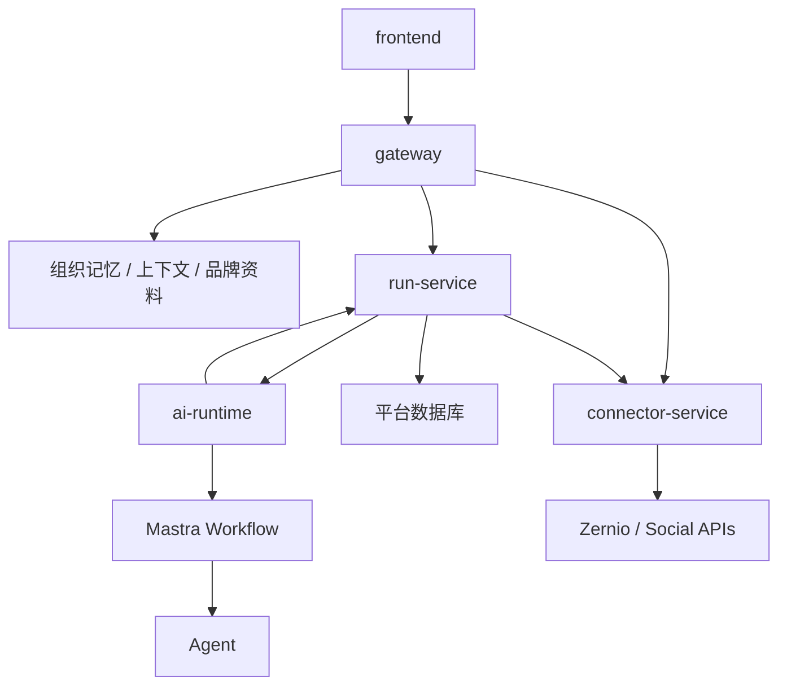
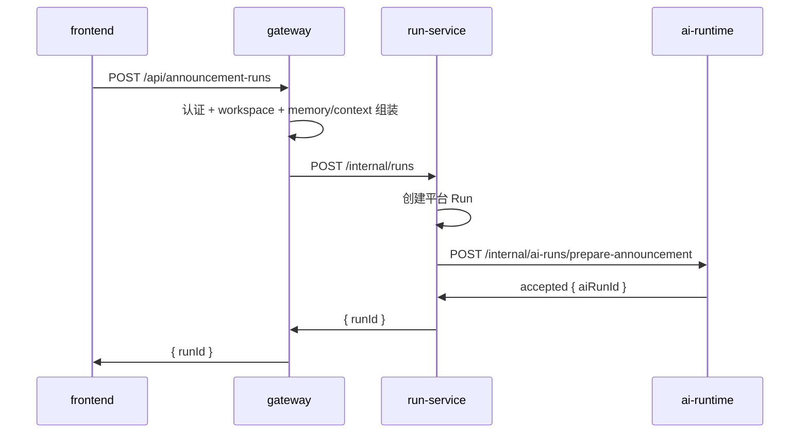
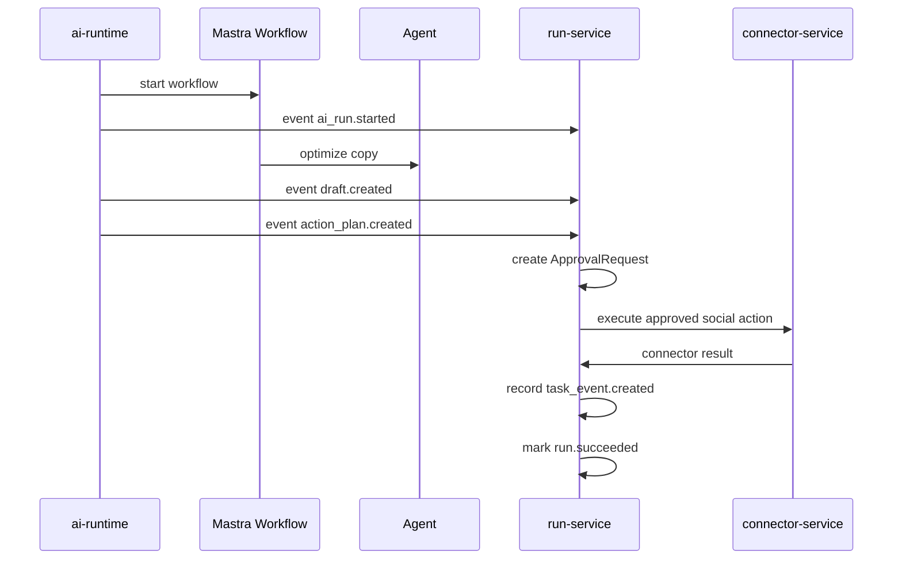
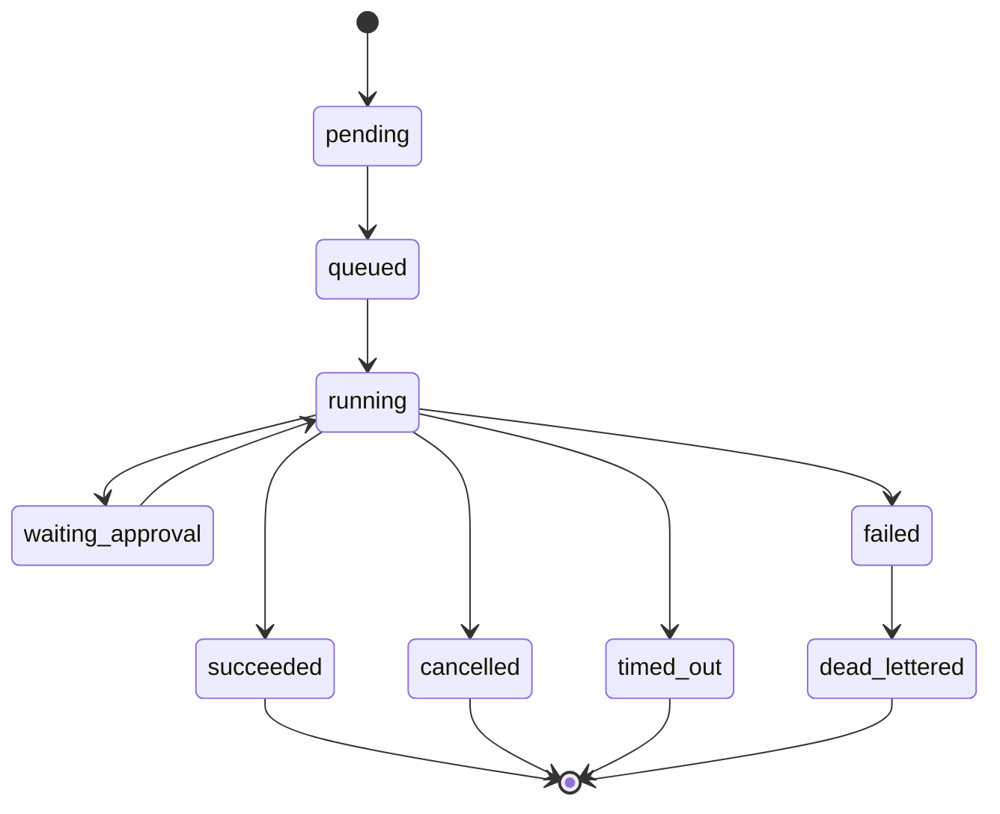

# 平台 Run Service + AI-Runtime 架构说明 — MVP Contract v0.3

> 目标：明确平台级营销自动化系统的服务边界。核心是把产品记忆、组织上下文、社交账号连接、任务生命周期、AI 执行这几类职责拆开，避免把状态、凭证和副作用动作混进 AI 执行层。
>
> Status: 已确认的 MVP contract。与产品范围对应的实现顺序见 `ai_Automation_Platform_Product_Architecture.md`。

## 1. 总体方向

系统拆成五个工程：

```text
frontend
gateway
run-service
connector-service
ai-runtime
```

核心原则：

> Gateway 负责业务上下文。Connector Service 负责外部账号连接和确定性动作执行。Run Service 负责任务生命周期。AI-Runtime 负责 AI 规划和结构化生成。AI workflow / agent 可以消费上下文，但不拥有平台记忆、connector 凭证或用户数据。

### 1.1 Confirmed implementation decisions

1. **Gateway business API from day one:** 浏览器永不访问 Mastra 或 Connector Service；AI Runtime 只对 Run Service 暴露业务级内部 API。
2. **Durable run model from day one:** MVP 使用 Postgres 的 Run/StepRun/event/outbox/job 表和 worker。专用 queue broker/Temporal 可以以后引入，但不能用同步 HTTP 或进程内 Map 作为任务 source of truth。
3. **No request-controlled callback URL:** AI Runtime 事件只发送到配置的 Run Service 内部地址；请求中的 `callbackUrl` 一律不接受，避免 SSRF。
4. **Approval is deterministic:** LLM 合规输出仅为建议。只有可信 Gateway/Run Service policy 可以定义是否免审批；`auto_approve` 不得因为 LLM "passed" 而绕过审批。
5. **Model boundary:** AI Runtime 包含 provider adapter 与 structured-output guardrails；Gateway 提供经过权限检查的 context/model policy snapshot；Run Service 记录 model usage、task usage 和 audit facts。

## 2. 系统关系图



## 3. 工程职责

### 3.1 frontend

面向用户的前端应用。

职责：

- 创建公告任务和其他营销自动化任务。
- 展示 run timeline、step 状态、审批、生成草稿和最终结果。
- 提交审批通过或拒绝。
- 不直接调用 Mastra Server。
- 只调用 `gateway`。

示例前端 API：

```http
POST /api/announcement-runs
GET /api/runs/{runId}
POST /api/approval-requests/{approvalRequestId}/approve
POST /api/approval-requests/{approvalRequestId}/reject
```

### 3.2 gateway

业务 API 层。

职责：

- 认证用户，并解析 `workspaceId`、`actorId`、组织和权限。
- 维护和读取组织记忆、品牌上下文、历史 approved examples、禁用词、workflow policy。
- 代理并聚合 connector 数据，提供给前端用户态 API。
- 把用户请求规范化为业务级 run request。
- 基于 connector 数据选择 connected accounts / platform targets。
- 把准备好的输入和上下文传给 `run-service`。
- 不把 Mastra 原始 API 暴露给前端。

Gateway 拥有：

- Workspace / user / org 权限。
- 品牌记忆和上下文编排。
- 面向用户的 connector / account API。
- 业务 API 形态。
- 产品级校验。
- 面向用户的数据聚合。

Gateway 不拥有：

- Durable run 状态机。
- Step 执行。
- Mastra workflow 内部逻辑。
- Connector 凭证实现。
- 外部社交平台副作用动作执行。

Gateway 必须在创建 run 前把以下 **immutable context snapshot** 交给 Run Service：`workspaceId`、`actorId`、workflow/version、BrandProfile、Policy、允许的 targets、允许的 AI model class。AI Runtime 不回读 Gateway 的用户数据。

### 3.3 connector-service

外部集成服务。

职责：

- 连接并同步外部社交账号。
- 通过 secret vault 管理 OAuth / API 凭证。
- 收集高频平台的 connected accounts：
  - Instagram
  - TikTok
  - YouTube
  - LinkedIn
  - X
  - Discord
  - Reddit
  - Substack
  - Telegram
  - Rednote
- 维护平台能力矩阵。
- 执行确定性的社交动作，例如 publish、schedule、retry、status lookup。
- 校验 workspace 范围内的账号归属和 connector 权限。
- 向调用方返回规范化 connector response。

Connector Service 拥有：

- `ConnectedAccount`
- OAuth / API credential references
- Account sync jobs
- Platform capability matrix
- Zernio SDK / API integration
- Social side-effect execution

Connector Service 不拥有：

- 面向用户的 API 形态。
- 长期组织记忆。
- Run 状态机。
- AI planning 或文案生成。

Gateway 代理 connector 数据给前端。Run Service 可以在任务执行阶段调用 Connector Service。

### 3.4 run-service

平台任务控制面。

职责：

- 创建平台级 `Run`。
- 维护 run 状态机。
- 保存 `aiRunId` / 底层 Mastra run id 映射。
- 执行 idempotency。
- 管理 retry、cancel、timeout、dead-letter。
- 创建并追踪 approval request。
- 记录 run timeline events。
- 记录 task / billing events。
- 接收 `ai-runtime` 的 callback / event，MVP 阶段也可以轮询 AI-Runtime run 状态。
- 调用 Connector Service 执行已经审批通过的确定性副作用动作。

Run Service 拥有：

- `Run`
- `RunStep`
- `RunEvent`
- `ApprovalRequest`
- `TaskEvent`（append-only usage ledger）
- `AIRuntimeRunMapping`
- `OutboxEvent` / `Job`（MVP durable worker）

Run Service 不拥有：

- 长期品牌记忆。
- Agent prompts。
- Connector credentials。
- Zernio SDK 实现。
- Mastra workflow definitions。

Run Service 对每个外部动作使用 `runId + stepId + attempt + actionType` 作为计量与去重基础，并是唯一可以写入 `TaskEvent`、`ApprovalRequest` 和最终 run 状态的服务。

### 3.5 ai-runtime

基于 Mastra 的 AI 执行面。

这个工程包含 Mastra execution runtime：

```text
ai-runtime
  src/mastra/index.ts
  src/workflows/prepare-announcement-workflow.ts
  src/agents/copy-optimization-agent.ts
  src/internal-api/
```

职责：

- 向 `run-service` 暴露内部 AI workflow 执行 API。
- 注册 Mastra workflows 和 agents。
- 执行 AI planning / generation workflow steps。
- 调用 agent 做文案优化或结构化推理。
- 向 `run-service` 发出执行事件。
- 返回结构化草稿、检查结果和 proposed action plan。

AI-Runtime 拥有：

- Mastra Server API。
- Mastra Workflow definitions。
- Agents。
- Structured output schemas。
- 执行时校验。

AI-Runtime 不拥有：

- 组织记忆数据库。
- 面向用户的平台数据。
- 产品 run lifecycle 的 source of truth。
- Billing account state。
- Connector credentials。
- Connected social accounts。
- Zernio SDK action implementation。
- 外部副作用动作执行。

## 4. 执行流程

### 4.1 创建 Run



### 4.2 执行 Run



## 5. API 边界

### 5.1 Frontend → Gateway

Frontend 使用产品级 API：

```http
POST /api/announcement-runs
GET /api/runs/{runId}
GET /api/runs/{runId}/events
GET /api/connectors/social/accounts
POST /api/connectors/social/connect
POST /api/approval-requests/{approvalRequestId}/approve
POST /api/approval-requests/{approvalRequestId}/reject
```

Frontend 不应该使用：

```http
/api/workflows/{workflowId}/start-async
```

### 5.2 Gateway → Run Service

示例：

```http
POST /internal/runs
```

Request：

```json
{
  "workspaceId": "ws_123",
  "actorId": "user_123",
  "runType": "send_announcement",
  "idempotencyKey": "req_abc",
  "input": {
    "brief": "发布新功能公告",
    "targets": [
      {
        "platform": "telegram",
        "accountId": "acc_123"
      }
    ]
  },
  "context": {
    "brandProfile": {
      "tone": "clear, concise, helpful",
      "forbiddenWords": ["guaranteed"]
    },
    "priorApprovedExamples": [],
    "approvalPolicy": "required"
  }
}
```

Response：

```json
{
  "runId": "run_123",
  "status": "pending"
}
```

### 5.3 Gateway → Connector Service

Gateway 调用 Connector Service 来做面向用户的账号管理和账号选择。

示例：

```http
GET /internal/connectors/social/accounts?workspaceId=ws_123
POST /internal/connectors/social/connect-url
POST /internal/connectors/social/sync-accounts
```

Gateway 再暴露为产品 API：

```http
GET /api/connectors/social/accounts
POST /api/connectors/social/connect
```

### 5.4 Run Service → AI-Runtime

长期推荐的内部 API：

```http
POST /internal/ai-runs/prepare-announcement
```

Request：

```json
{
  "platformRunId": "run_123",
  "workspaceId": "ws_123",
  "actorId": "user_123",
  "input": {
    "mode": "draft",
    "brief": "发布新功能公告",
    "targets": [
      {
        "platform": "telegram",
        "accountId": "acc_123"
      }
    ]
  },
  "executionContext": {
    "brandProfile": {
      "tone": "clear, concise, helpful",
      "forbiddenWords": ["guaranteed"]
    },
    "approvalPolicy": "required"
  }
}
```

AI Runtime 事件的 destination 由 `RUN_SERVICE_CALLBACK_URL` 配置；该 URL 只能由部署配置提供，不属于 request contract。Run Service 也可以轮询内部状态作为 callback delivery 失败时的兜底。

AI-Runtime 内部可以调用 Mastra 原生 route：

```http
POST /api/workflows/prepare-announcement-workflow/start-async
```

但 `run-service` 从 MVP 起就不应该感知 Mastra 原生 route。

### 5.5 Run Service → Connector Service

Run Service 调用 Connector Service 执行已经审批通过的确定性副作用动作。

示例：

```http
POST /internal/connectors/social/posts
```

Request：

```json
{
  "workspaceId": "ws_123",
  "platformRunId": "run_123",
  "idempotencyKey": "run_123:post:telegram:acc_123",
  "action": {
    "type": "social.create_post",
    "platform": "telegram",
    "accountId": "acc_123",
    "content": "我们发布了新的公告功能...",
    "mode": "publish_now"
  }
}
```

## 6. Run 状态模型

建议的平台 run 状态：

```text
pending
queued
running
waiting_approval
succeeded
failed
cancelled
timed_out
dead_lettered
```

建议的 step 状态：

```text
pending
running
succeeded
failed
skipped
waiting_approval
cancelled
```

状态流转草图：



## 7. 事件契约

AI-Runtime 应该向 Run Service 发出 AI 执行事件。

初始事件类型：

```text
ai_run.started
ai_step.started
ai_step.succeeded
ai_step.failed
draft.created
action_plan.created
ai_run.succeeded
ai_run.failed
```

示例：

```json
{
  "eventId": "evt_123",
  "platformRunId": "run_123",
  "aiRunId": "ai_run_456",
  "type": "draft.created",
  "createdAt": "2026-07-08T07:00:00.000Z",
  "payload": {
    "stepId": "copy-optimization",
    "contentPreview": "我们发布了新的公告功能...",
    "characterCount": 128
  }
}
```

Connector Service 可以向 Run Service 发出事件，也可以同步返回 connector execution result。

所有内部事件必须包含 `eventId`、`platformRunId`、`createdAt` 和 producer 的 `attempt`。Run Service 按 `eventId` 去重，并将可恢复的事件先写入 outbox 再投递；事件投递失败不得改变已完成的 workflow/connector 状态。

Connector 事件类型：

```text
connector.action.started
connector.action.succeeded
connector.action.failed
connector.account.synced
connector.auth.expired
```

## 8. 上下文和记忆边界

Gateway 拥有记忆和上下文读取。

示例：

- 组织记忆。
- 品牌语气。
- 历史 approved examples。
- 禁用词。
- Connected account selection。
- 用户权限。
- Workflow policy。

AI-Runtime 接收这些执行时上下文：

```json
{
  "workspaceId": "ws_123",
  "actorId": "user_123",
  "brandProfile": {
    "tone": "clear, concise, helpful",
    "forbiddenWords": ["guaranteed"]
  },
  "runPolicy": {
    "approvalRequiredForPublish": true
  }
}
```

AI-Runtime 可以在执行时使用这些上下文，但不把长期记忆持久化为 source of truth。

`approvalPolicy: none` 是受权限和审计保护的 Gateway/Run Service 选择，不能由浏览器输入或 LLM 输出决定。`auto_approve` 表示可自动推进低风险的 **AI preparation**，并不允许自动发布。

## 9. 数据归属

| 数据 | Source of Truth |
|---|---|
| Workspace / user / org | gateway platform DB |
| Brand memory / org context | gateway memory store |
| Connected account user-facing view | gateway API |
| Connected account source of truth | connector-service DB + Zernio |
| Platform run | run-service DB |
| Step / timeline events | run-service DB |
| Approval request | run-service DB |
| Task / billing event | run-service DB |
| Mastra workflow definition | ai-runtime code |
| Agent prompt / instructions | ai-runtime code |
| Structured action plan schema | ai-runtime code |
| Zernio SDK action implementation | connector-service code |
| AI-Runtime / raw Mastra run id | run-service mapping table |

## 10. 扩展和部署说明

### Gateway

- 无状态，可横向扩容。
- 读写共享平台 DB 和 memory stores。

### Run Service

- 需要持久化，基于数据库保存状态。
- 后续可以拆成 API + worker。
- 拥有 idempotency、retry、timeout 和状态流转。

### Connector Service

- 需要持久化，基于数据库保存账号和凭证引用。
- 拥有 connector credentials 和 account sync。
- 向 Run Service 暴露内部执行 API。
- 向 Gateway 暴露内部账号管理 API。
- 每次 action 都要校验 workspace / account ownership。

### AI-Runtime

- 如果需要跨进程恢复 Mastra 状态，需要使用共享 storage。
- 生产环境不能依赖本地 JSONL 文件。
- 只向可信内部服务暴露 API。
- 不保存 connector credentials 或长期记忆。
- 不直接执行外部社交平台副作用动作。
- Mastra Studio 需要鉴权保护，并且最好按环境隔离。

## 11. MVP vs Later

### MVP

- Frontend 只通过 Gateway 创建 run、查看 timeline 和处理 approval。
- Gateway 完成认证、workspace RBAC、context/policy snapshot 与产品级校验。
- Run Service 在 Postgres 中创建 Run/StepRun/ApprovalRequest/TaskEvent/AuditEvent，使用 outbox/job worker 推进状态。
- AI Runtime 执行 AI workflow，返回结构化 draft/action plan，并向配置的 Run Service destination 发送事件；polling 是兜底。
- Run Service 校验 action plan，在人工审批后调用 Connector Service 的确定性动作 API。
- Connector Service 校验 workspace/account ownership，执行 Zernio 动作并返回规范化结果。
- 成功的 AI step 和外部 action 由 Run Service 生成可审计、幂等的 task usage record。

### Later

- 流式 run timeline。
- Run Service 和 AI-Runtime/Connector Service 之间引入专用 durable queue 或 Temporal。
- Dead-letter queue。
- 从失败 step replay。
- Human approval notification channels。
- Per-workspace execution policy。

## 12. Resolved architecture decisions

| Question | Decision |
|---|---|
| Mastra API exposure | AI Runtime exposes a business-friendly internal API from day one. Raw Mastra routes are staging-only operational tools. |
| Long task decomposition | Run Service owns the top-level workflow and state machine. AI Runtime produces scoped plans/results; Run Service validates, approves and schedules the next deterministic action. |
| Queue strategy | MVP uses a Postgres outbox/job worker. A broker/Temporal is later infrastructure, not a reason to defer retries, schedules or durable state. |
| AI Runtime persistence | Shared LibSQL (or a supported shared database adapter) is required for runtime polling/recovery. The platform task/audit ledger remains in Run Service's Postgres store; it is not a blockchain/state tree. |
| Mastra Studio | Staging only. Production endpoints are internal-only and protected with service authentication. |
| Connector dispatch | Run Service may make a synchronous connector call only from a durable worker and only with an idempotency key. Long/rate-limited actions are scheduled jobs. |
| Connected-account read model | Connector Service is source of truth. Gateway may keep a denormalized, TTL-bound read model for UX latency; mutations and permission decisions always revalidate against Connector Service. |

## 13. Current consensus

当前假设方向：

```text
frontend
  -> gateway business APIs
  -> run-service platform run lifecycle
  -> ai-runtime execution APIs
  -> Mastra workflow / agent / structured action plan
  -> connector-service social side effects
```

AI-Runtime 包含：

```text
Mastra Server API
Mastra Workflow
Agent
Structured output schemas
```

AI-Runtime 不包含：

```text
organization memory
long-term context source of truth
user-facing platform data
billing account source of truth
connector credentials
connected social accounts
Zernio SDK Adapter
external side-effect execution
```
